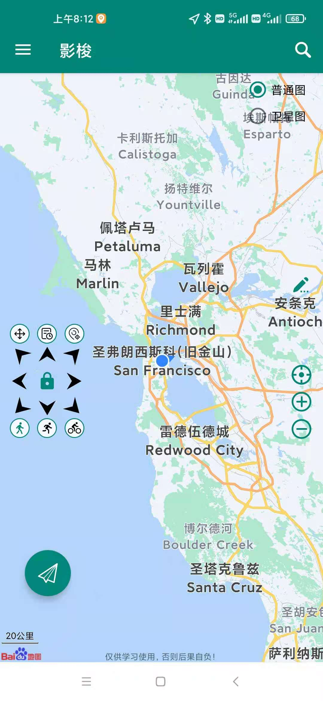
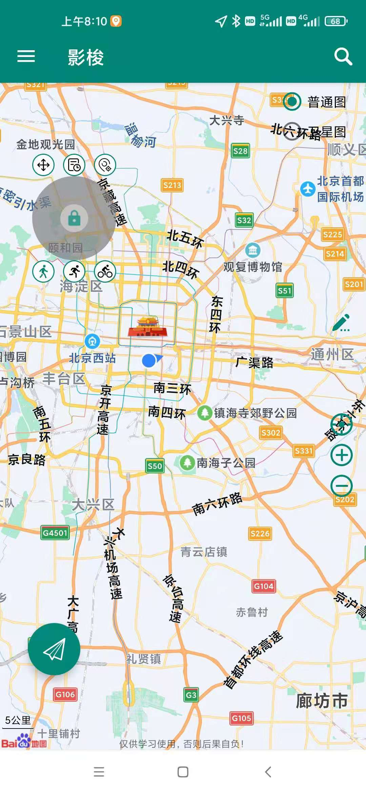

影梭 - 用于 Android 8.0+ 的虚拟定位软件。

##
影梭是一个基于 Android 调试 API + 百度地图实现的虚拟定位工具，并且同时实现了一个可以自由移动的摇杆。

## 🍕 背景
最新在玩一款 VR 游戏：一起来捉妖。为了省事（实在是没有时间出去瞎溜达，仅仅是作为休闲游戏，没事的时候就玩玩），就想有没有可以更改位置的 APP。经过一番摸索发现确实有不少可以修改位置的 APP，使用这种 APP 就不用实际跑出去了。但是，绝大多数这种 APP 都是收费的！这就尴尬了，我就偶尔玩玩，再每月花钱买个这个就没必要了，所以准备自己写一个！

## 🍔 功能
1. 定位修改
2. 摇杆控制移动
3. 历史记录
4. 位置搜索

## 文档
由于本人并不是做移动开发的，很多功能代码写的都比较差。我也第一次写  Android APP，目前还处在学习中。。。

就一个简单的 APP，应该也不需要啥文档，开发过程中遇到的一些问题，我一般都会记录在个人博客中，具体参见：https://blog.csdn.net/zcshoucsdn/category_10559121.html

其次，就是参考 ISSUE 中的各个问题的说明。

## 🍟 截图

## 🌭 用法
下载 APK 直接安装即可

## 🥦 如何贡献
1. FORK -> PR
2. 成为开发者，共同完善影梭

## 🍟 许可证

